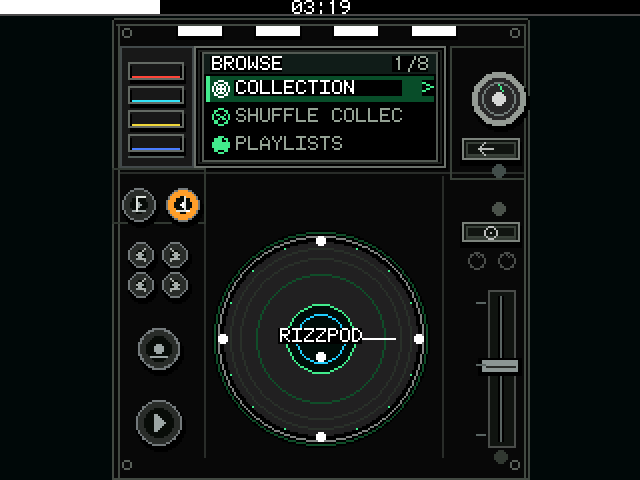
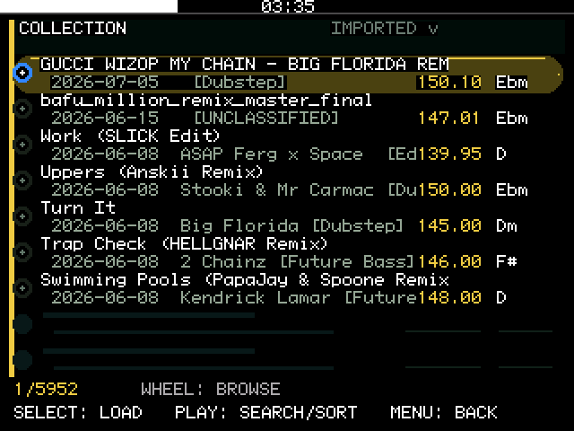
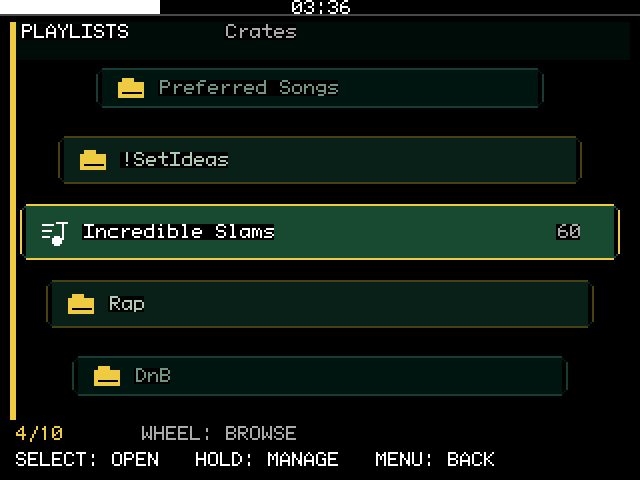
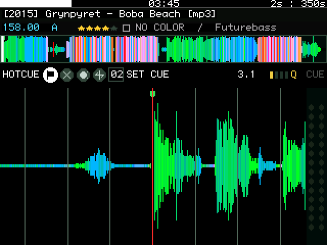
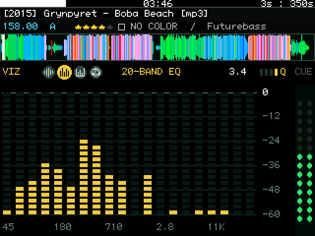
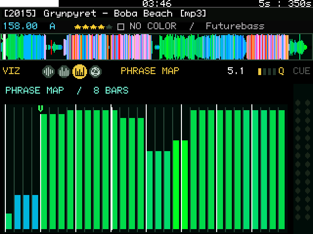
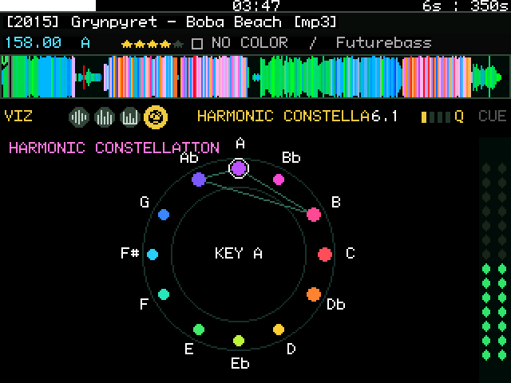
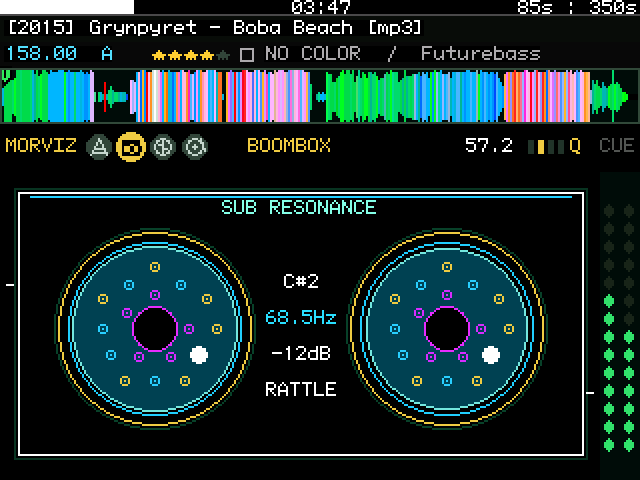
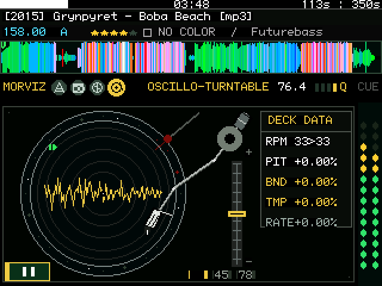

# Rekordpod

**Rekordpod turns a Rockbox-compatible 6th- or 7th-generation iPod Classic into
a standalone "smart DJ drive" for library preparation.** It is built on top of
a substantial [Rockbox](https://www.rockbox.org/) fork: Rockbox provides the
bootloader, playback, storage, display, and click-wheel foundation, while
Rekordpod adds its DJ interface and a data layer for traditional Rekordbox
exports.

**What does this smart DJ drive actually do?** It lets you browse and search the
collection, preview tracks, inspect analysis, edit cues and beat grids, organize
playlists, rate tracks, and retain that work without a laptop nearby.

The iPod still carries the music and connects to a computer or compatible
player as USB storage, but it also has its own screen, controls, playback engine,
waveform views, preparation deck, and traditional Device Library writer.

Rekordbox on the laptop remains the analysis and export station. Once the drive
is provisioned, Rekordpod can work independently and later return supported
changes through the traditional Device Library by updating
`PIONEER/rekordbox/export.pdb` and the matching ANLZ files. **OneLibrary / Device
Library Plus is a separate, newer backend that Rekordpod does not read or
write.** The iPod can physically carry a separate OneLibrary export and present
it to compatible players, but Rekordpod will not modify or reconcile that
database. Changes intended for OneLibrary must first return to Rekordbox through
the traditional Device Library and then be published as a separate OneLibrary
export.

> **Public beta warning**
>
> Rekordpod can rewrite a DJ library. Keep a tested backup of the entire
> `PIONEER` directory and use a disposable or reproducible export until the
> exact build has passed the release gate in [TESTING.md](TESTING.md). A
> successful compile is not evidence that database writes are safe on every
> library, storage adapter, or player.

**[Download Rekordpod Public Beta 2](https://github.com/spreadsheetrizzard/rekordpod/releases/tag/v1.0.0-beta.2)**
— one cross-platform iPod Classic overlay ZIP; no desktop installer is required.



*A DJ library inside the click wheel: Rekordpod's CDJ-inspired main menu.*

## Current targets

| Target | Status | Notes |
| --- | --- | --- |
| iPod Classic 6G/7G | Primary public-beta target | Larger waveform/index caches; optional USB audio path remains experimental |
| Other Rockbox devices | Unsupported | No other target is distributed or claimed compatible in this public beta |

Flash-storage conversions, SSDs, microSD adapter arrays, and original hard
drives all exercise different timing and write behavior. They are separate test
configurations, not interchangeable proof of reliability.

## What is included

- Rekordbox-style collection search, precomputed sort orders, playlist and
  folder browsing, favorites, shuffle, and ordered playlist work.
- A playback-first Prep Deck with seek, scrub, zoom, gain, hot-cue, beat-grid,
  rating, tempo/RPM, loop, playlist, and quantize tools, plus two
  persistent workflow pads.
- RGB waveform and seven audio/analysis views: 20-band EQ, phrase map,
  harmonic constellation, spectral canyon, boombox, stereo orbit, and
  Oscillo-Turntable.
- Transactional on-device editing with verified temporary files, retained
  rollback copies, and append-only edit state.
- A 512-byte USB Mass Storage presentation for the iPod Classic while the
  device keeps its internal 4096-byte virtual-sector handling.
- Power-only USB by default, with Data Transfer and the experimental USB DAC
  mode armed deliberately inside Rekordpod.
- A matching grey Rockbox theme and an optional Rekordpod auto-boot path.

## Rekordpod on the device

These are direct framebuffer captures from the primary iPod Classic build—not
desktop recreations or design mockups. The interface is built around a 320×240
screen, five physical buttons, and the click wheel.

| Collection browser | Playlist carousel |
| :---: | :---: |
|  |  |

### Preparation and analysis

| Hot-cue tools and detailed waveform | 20-band EQ |
| :---: | :---: |
|  |  |

| Phrase map | Harmonic constellation |
| :---: | :---: |
|  |  |





*Oscillo-Turntable combines a Technics-inspired deck, an unrotated oscilloscope,
RPM conversion, pitch, bend, tempo, and a live VU meter.*

The private framebuffer screenshot shortcut is compiled **out** of the public
build. The gallery above was captured from a controlled device-testing build
with that build-time flag enabled. The implementation remains visible in the
source, but the shortcut is absent from public binaries. See the harvesting
checklist in [TESTING.md](TESTING.md).

## Rekordbox compatibility

Rekordpod works with the traditional Rekordbox Device Library: `export.pdb`
plus DAT/EXT analysis files. Supported edits are written directly to that data
on the iPod for use by Rekordbox and compatible players that support the
traditional Device Library.

The public-beta return contract is deliberately narrow:

| On-iPod action | Rekordbox return path |
| --- | --- |
| Hot cues, cue colors, and beat grid | **Update Collection** (`CUE / GRID / INFO`) |
| Star rating | **Update Collection** (`CUE / GRID / INFO`) |
| Create, add to, or permanently reorder an ordinary playlist | **Import Playlist from Device**; imported as a static playlist |
| Rekordpod smart-playlist query | Device-local only; current results may be materialized as an ordinary playlist, but the rule does not round-trip |
| Genre, track color, year, musical key, comments, and tags | Visible/searchable reference data; read-only in Rekordpod |

Anything Rekordpod creates is placed beneath the top-level
`REKORDPOD - IMPORT ME` folder. Add-to-playlist is idempotent and permanent
reordering validates that every original member occurs exactly once. Rekordbox
playlist import is not a live two-way merge: importing the same device playlist
again may create another desktop copy, and desktop export can replace later
device-only organization. Import the Rekordpod folder deliberately, verify it,
then merge or replace desktop playlists in Rekordbox.

Rekordpod does not read or write OneLibrary / Device Library Plus. The same
iPod can contain a separately generated OneLibrary export and serve as the
physical USB drive for that export, but that does not make the newer database
visible to Rekordpod. Traditional Device Library and OneLibrary data on one
drive are independent snapshots. Editing one does not update the other, so
using both without deliberately re-importing and re-exporting changes will
produce database discrepancies.

### Using Rekordpod with a OneLibrary collection

Rekordpod can still be part of a OneLibrary preparation workflow:

1. Export a traditional Device Library from Rekordbox to the iPod.
2. Prepare tracks and make supported changes in Rekordpod.
3. Reconnect the iPod and update cue/grid/rating information; separately import
   playlists beneath `REKORDPOD - IMPORT ME` into the main Rekordbox collection.
4. Create or update the OneLibrary / Device Library Plus export from Rekordbox,
   either on the same iPod or on separate performance media.

The traditional iPod export is the interchange path in this workflow. It does
**not** become a OneLibrary database. Playback hardware that requires the newer
format still needs a separate, valid OneLibrary export, even when both exports
are stored on the same iPod.

### Using the iPod as CDJ media

Users who primarily use the traditional Device Library can also connect the
iPod as a USB drive to compatible CDJs and play from that export. This is an
experimental, at-your-own-risk use: test the exact iPod, storage adapter,
capacity, Rekordpod build, CDJ model, and CDJ firmware before relying on it.
Keep another verified copy of the performance library available.

Original spinning disks are particularly vulnerable to shock, vibration,
spin-up delays, and marginal USB power in a live environment. For performance
use, solid-state storage or flash cards in a known-compatible third-party iPod
adapter are recommended. That reduces mechanical risk but does not guarantee
player, filesystem, adapter, or power compatibility.

Rekordpod converts an existing Device Library and ANLZ corpus into its compact
index and waveform cache on the iPod. The desktop utilities in
[`utils/rekordpod`](utils/rekordpod) remain available to maintainers for
recovery, diagnostics, and reproducible format tests, but they are not required
for ordinary installation or updates.

## What setup requires

Rekordpod is not installed by copying `rekordpod.rock` onto an arbitrary
Rockbox build. The plugin, modified Rockbox firmware, codecs, USB behavior, and
on-device cache format are a matched set.

You need:

1. **A supported 6th- or 7th-generation iPod Classic with a working Rockbox
   installation and bootloader.** Rekordpod runs on Rockbox; it does not replace
   the Apple firmware partition or install its own bootloader.
2. **A traditional Rekordbox Device Library already exported to the iPod.**
   Analyze the tracks in Rekordbox before exporting them because Rekordpod does
   not perform full audio analysis on the iPod.
3. **The matching iPod Classic release overlay:**
   `rekordpod-public-beta-2-ipod6g.zip`. It is the same ZIP on Windows, macOS,
   and Linux.

### Why no desktop executable is required

The release ZIP contains the matched Rockbox firmware, codecs, plugin, theme,
and boot configuration. After the overlay is copied, Rekordpod itself:

- validates the traditional Device Library on the iPod;
- builds its compact collection and playlist index locally;
- offers to prepare all existing Rekordbox waveform, beat-grid, and cue data;
- prepares skipped tracks individually the first time they are opened; and
- repeats the library update after a deliberate USB Data Transfer session.

This local preparation is a conversion of analysis already produced by
Rekordbox. It does **not** analyze or re-encode audio. The overlay does not
format the iPod, install the Rockbox bootloader, or erase the `Contents` or
`PIONEER` trees.

### Setup in four steps

1. Install and boot the normal Rockbox build for the exact iPod model.
2. Analyze the collection in Rekordbox and export a traditional Device Library
   to the iPod.
3. Mount the iPod and merge the release ZIP's `.rockbox` directory into the
   existing `.rockbox` directory. Do not replace the whole directory.
4. Eject cleanly, boot without USB attached, and choose **Prepare** when
   Rekordpod offers to build its local analysis bridge. **Later** is safe and
   leaves each track to be prepared on first open.

For the safe clean-install rehearsal, translated USB-storage warning, and
recovery checkpoints, follow [INSTALL.md](INSTALL.md).

## Upgrades and user state

Merge the new release overlay for ordinary installation and upgrades. This
public beta intentionally starts with a clean Rekordpod state namespace; it
does not import settings, caches, or workflows from earlier pre-release
namespaces. Rekordpod creates its device cache locally on first launch.
Preserve these user-owned files across later Rekordpod upgrades:

- `/.rockbox/rekordpod/state/`
- `/.rockbox/rekordpod/rekordpod.cfg`
- `/.rockbox/rekordpod/smart-playlists.rbq`
- `/.rekordpod-workflows.rbl`

The plugin is packaged as `/.rockbox/rocks/apps/rekordpod.rock`, but it depends
on the rest of the matching Rekordpod Rockbox build and cache. Installation and
testing must never alter Apple firmware partitions. Follow the [clean-install
rehearsal](INSTALL.md), then complete [TESTING.md](TESTING.md) before connecting
a production library.

## Building

Start with Rockbox's [build instructions](docs/README), configure a separate
build directory for each target, then build and package normally:

```sh
make -j4
make zip
```

Public builds use the default `REKORDPOD_PRIVATE_SCREENSHOTS=0`. Maintainers can
compile the retained private capture implementation for controlled internal
testing by setting that build variable to `1`; such binaries are not public
release artifacts.

Host-side Rekordpod utilities use the pinned packages in
[`utils/rekordpod/requirements.txt`](utils/rekordpod/requirements.txt). Their
detailed workflow is documented in
[`utils/rekordpod/README.md`](utils/rekordpod/README.md).

## Release evidence

Every distributed ZIP should be tied to one commit and accompanied by:

- target model and storage configuration;
- SHA-256 digest of the exact ZIP;
- clean build and ZIP-integrity results;
- automated test results;
- the completed hardware matrix from [TESTING.md](TESTING.md);
- known limitations and reproducible failure reports.

Do not advertise an archive as passing a device configuration that was not
tested with that exact archive.

## Project documentation

- [About Rekordpod](ABOUT.md)
- [Installation and recovery](INSTALL.md)
- [Public-beta release notes](RELEASE_NOTES.md)
- [Testing and screenshot checklist](TESTING.md)
- [Contributing](CONTRIBUTING.md)
- [Security and destructive data-loss reporting](SECURITY.md)
- [Sources, licenses, and disclosure](ATTRIBUTION.md)

## License, sources, and disclosure

This fork is distributed under the GNU General Public License, version 2 or
later, following Rockbox. See [docs/COPYING](docs/COPYING) for the license and
[ATTRIBUTION.md](ATTRIBUTION.md) for the complete source, dependency, font,
trademark, and AI-assistance record.

Rekordpod has been developed through a **vibe-coding workflow with OpenAI Codex
using GPT-5.6 Sol**, under human direction and testing. AI assistance is not a
substitute for code review, data backups, or physical-device validation.

Rekordpod is an independent interoperability project. It is not affiliated
with or endorsed by Rockbox, Apple, AlphaTheta/Pioneer DJ, Ableton,
Panasonic/Technics, or OpenAI. Product names and trademarks belong to their
respective owners.
